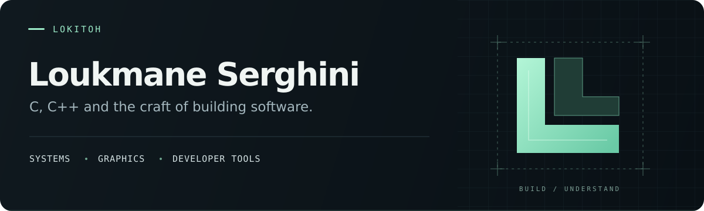
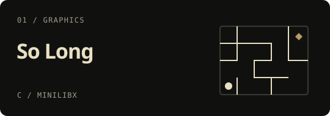
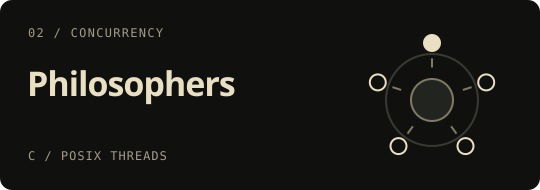
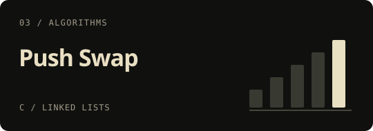
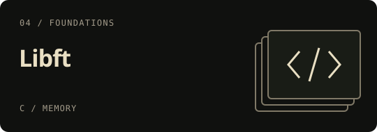

  

  <a href="mailto:loukmane.serghini@gmail.com">Email</a> &nbsp; / &nbsp;
  <a href="https://www.linkedin.com/in/loukmane-serghini-860a49357/">LinkedIn</a> &nbsp; / &nbsp;
  <a href="https://github.com/Lokito-H?tab=repositories">Explore my repositories ↗</a>

I'm **Loukmane**, but you'll usually find me as **LokitoH**. I'm studying at **1337**, part of the **42 Network**, and most of my work starts with C, C++, and a question about how something works underneath.

I like the parts you don't see on the screen: how memory is managed, how threads share resources, and how a program turns data into pixels. Lately, I've been spending more time on **game engines and editor tools**, working with **SFML and Dear ImGui**.

I care about the interface, too. Building a feature is one part of the job; making it clear and comfortable to use is another part I want to get better at.

  
   
  My 1337 journey · <a href="https://github.com/oakoudad/badge42">42 badge</a>

A few public projects from my time at 1337. Each explores a different part of the fundamentals.

<table>
  <tr>
    <td width="50%" valign="top">
      
      
A 2D game built around tiles, movement, and collectibles. Includes map validation and flood fill to check that the level is playable.

      <a href="https://github.com/Lokito-H/SO_LONG">Explore So Long ↗</a>
    </td>
    <td width="50%" valign="top">
      
      
A dining philosophers simulation using threads and mutexes, with a monitor tracking timing and the state of the simulation.

      <a href="https://github.com/Lokito-H/PHILOSOPHERS">Explore Philosophers ↗</a>
    </td>
  </tr>
  <tr>
    <td width="50%" valign="top">
      
      
Sorting with two stacks and a small set of instructions. Uses chunks and move-cost selection to decide which element to move next.

      <a href="https://github.com/Lokito-H/PUSH_SWAP">Explore Push Swap ↗</a>
    </td>
    <td width="50%" valign="top">
      
      
A reusable C library for strings, memory, and linked lists. The foundation I built before moving on to larger projects.

      <a href="https://github.com/Lokito-H/LIBFT">Explore Libft ↗</a>
    </td>
  </tr>
</table>

**Also in my repositories:** [ft_printf](https://github.com/Lokito-H/FT_PRINTF) · [get_next_line](https://github.com/Lokito-H/GET_NEXT_LINE) · [minitalk](https://github.com/Lokito-H/MINITALK)

| Area | Tools & technologies |
| :--- | :--- |
| Languages | **C**, **C++**, Bash |
| Graphics & interfaces | SFML, Dear ImGui, MiniLibX |
| Everyday development | Linux, Git, Make |
| Containers & services | Docker, Docker Compose, NGINX, MariaDB |

If you're working on a game engine, a useful developer tool, or an interesting C++ project, I'd enjoy hearing about it.

**[Send me an email ↗](mailto:loukmane.serghini@gmail.com)** &nbsp; · &nbsp; [Connect on LinkedIn](https://www.linkedin.com/in/loukmane-serghini-860a49357/)

 

